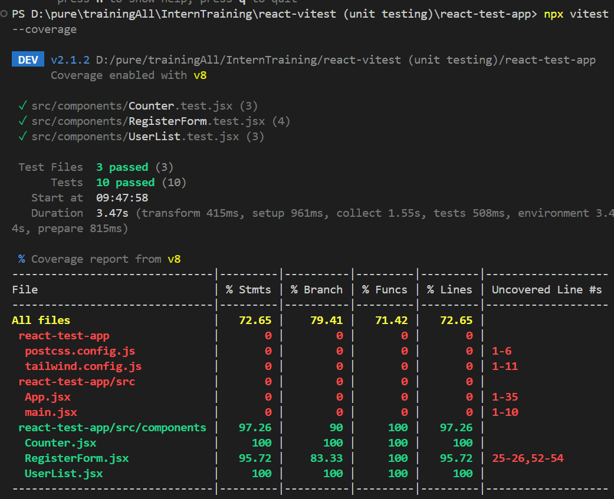
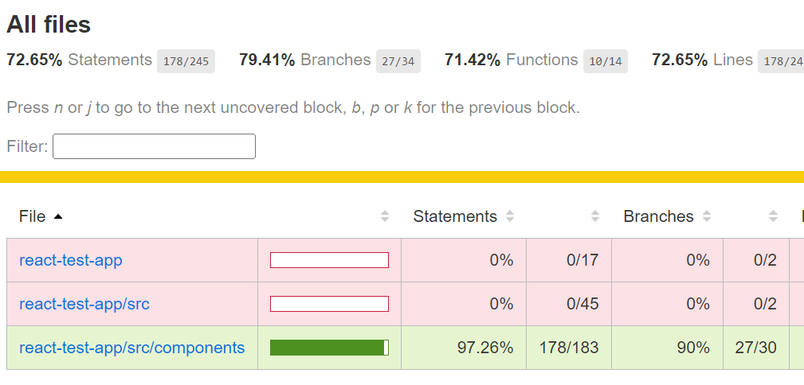
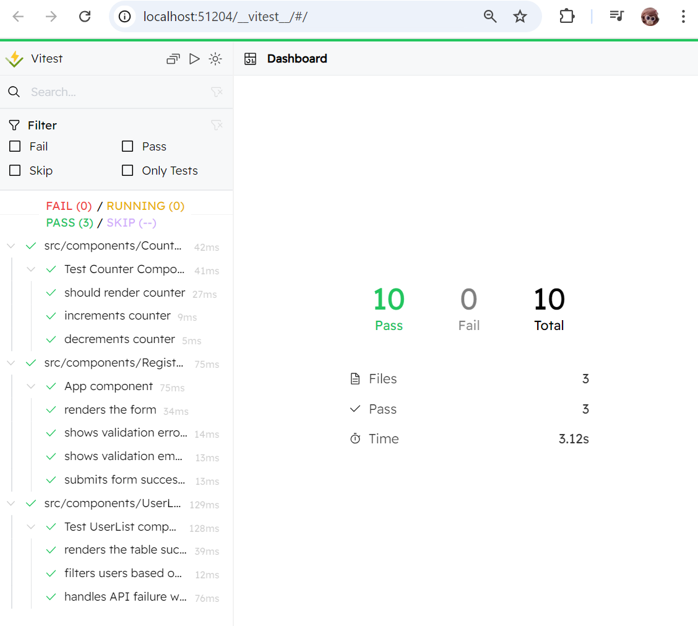
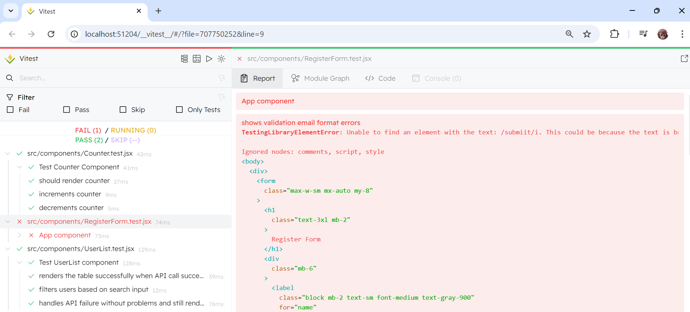

## Unit Test

- [https://youtu.be/4DtZ_pXSDCY?si=YWpuS97MNhYgUbTI]
- [https://tailwindcss.com/docs/guides/vite]
- [https://vitest.dev/]
- [https://testing-library.com/docs/queries/about]

## Command

    cd react-test-app
    npm install
    npm run dev

### 1. run test (change reload)

```
 npx vitest
```

ตัวชี้วัด software testing > ว่าเรา cover ไปแค่ไหน

```
npx vitest --coverage
```



```
start coverage/index.html
```



```
npx vitest --ui
```



