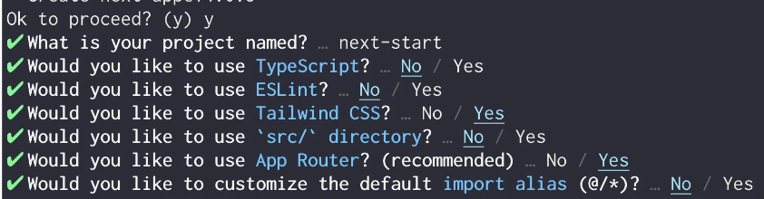

### [https://docs.mikelopster.dev/c/web-workshop-pccth/day2-nextjs]

# Next.js

- [https://nextjs.org/]

## Start

- [https://nextjs.org/docs/getting-started/installation]

#### Set up project

```
npx create-next-app@latest
```



#### Start/run project

```
npm run dev
```

#### client

- [https://nextjs.org/docs/app/building-your-application/rendering/client-components]

#### Dynamic route

- [https://nextjs.org/docs/app/building-your-application/routing/dynamic-routes]
- [https://nextjs.org/docs/app/building-your-application/routing/dynamic-routes#optional-catch-all-segments]

#### Middleware

- [https://nextjs.org/docs/app/building-your-application/routing/middleware]
