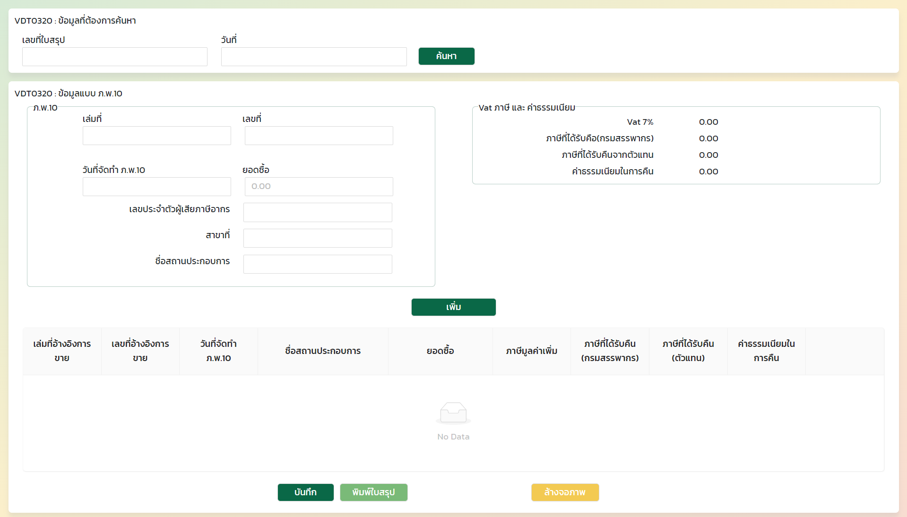

# HomeworkTwo

This project was generated with [Angular CLI](https://github.com/angular/angular-cli) version 11.2.19.

## Development server

Run `ng serve` for a dev server. Navigate to `http://localhost:4200/`. The app will automatically reload if you change any of the source files.

## เอกสารที่เกี่ยวข้อง
https://ng.ant.design/docs/introduce/en

node -v 

npm install

ng serve