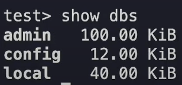

## DOC

- [https://youtu.be/ufonGrmL-KE?si=JDj7dD_zW_WRyxC-]
- [https://mikelopster.dev/posts/nestjs-mongo]
- [https://docs.nestjs.com/first-steps]
- [https://docs.nestjs.com/cli/usages]

### Start

```
npm i -g @nestjs/cli
# choose npm
nest new project-name
cd project-name
```

### run

```
npm start

# watch เวลาแก้ไข มันจะแก้ตาม
npm run start:dev
```

### create

```
# สร้าง Controller
nest generate controller <name>
# สร้าง Service
nest generate service <name>
# สร้าง Module
nest generate module <name>
```

### Mongo

> [https://docs.nestjs.com/techniques/mongodb]

```
 npm i @nestjs/mongoose mongoose
```

> วิธีการเช็ค

```
docker ps
```

```
docker exec -it <name-docker> bash
```

`<name-docker> : ได้จากการ docker ps`

```
mongosh -u root -p
```

`Enter password: ตัวแปร MONGO_INITDB_ROOT_PASSWORD นี้ในไฟล์ docker-compose.yml`

```
show dbs
```

> ก็จะแสดง 

### สร้าง set CRUD

```
nest g resource products
```

`.
── src
   ├── app.controller.spec.ts
   ├── app.controller.ts
   ├── app.module.ts
   ├── app.service.ts
   ├── main.ts
   └── products
       ├── dto
       │   ├── create-product.dto.ts
       │   └── update-product.dto.ts
       ├── entities (ลบก่อนเนื่องจากเราไม่ได้ใช้ใน case นี้ )
       ├── products.controller.spec.ts
       ├── products.controller.ts
       ├── products.module.ts
       ├── products.service.spec.ts
       └── products.service.ts`

### ค้าง [52.20]