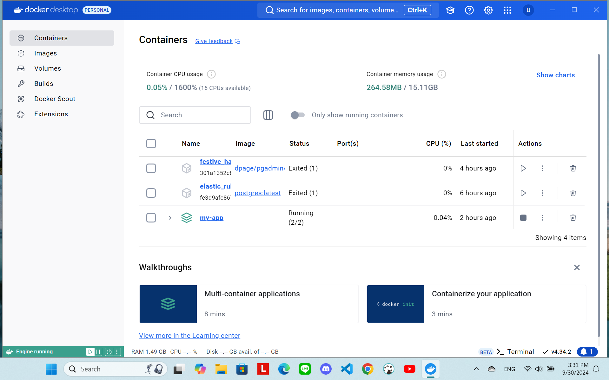
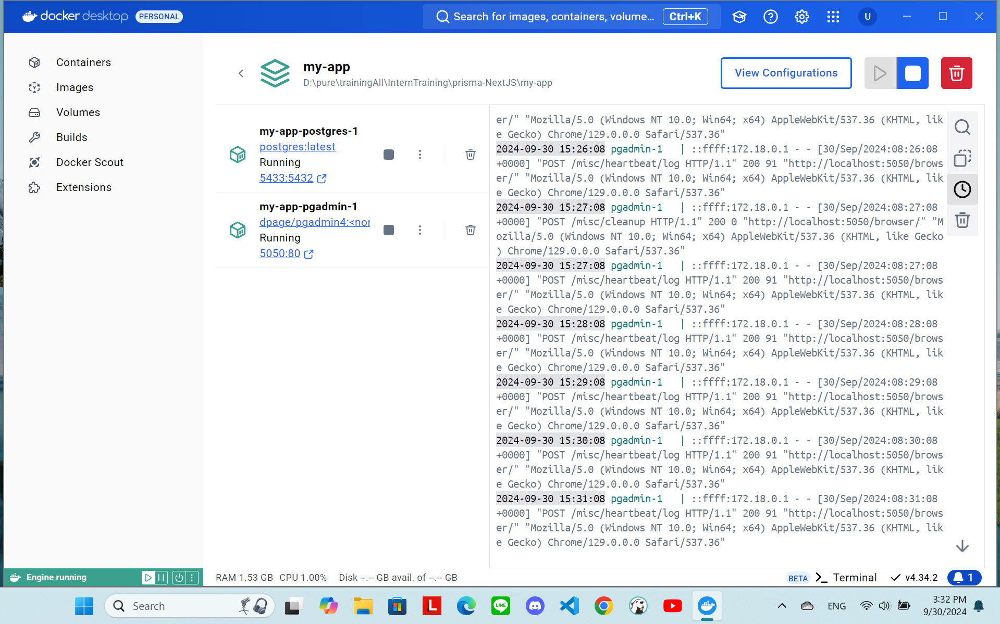

start [https://mikelopster.dev/posts/next-prisma]

1. โหลด Docker
    docker --version
    docker-compose --version
    `สร้างไฟล์ docker-compose.yml`
    docker-compose up -d

2. ติดตั้ง prisma
    npm install prisma --save-dev
    npm install @prisma/client

3.  create prisma
    npx prisma init
    - learn more about it in the docs: https://pris.ly/d/prisma-schema
    - https://www.prisma.io/docs/orm/prisma-schema/overview

4. extend Prisma

## Other
    npx prisma migrate dev --name <ชื่อ migrate>

#### pic

