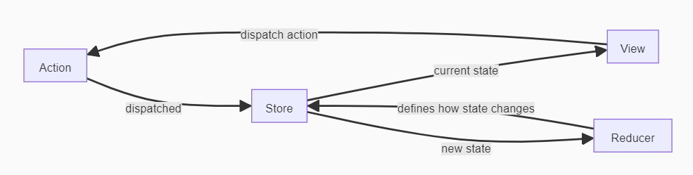

## Start
#### 1.
    npm create vite@latest <name-project> -- --template react
#### 2.
    cd my-redux-app
#### 3.
    npm install
#### 4.
    npm run dev
#### 5.
    npm i redux
#### 6.
    npm install react-redux

## "pic"
